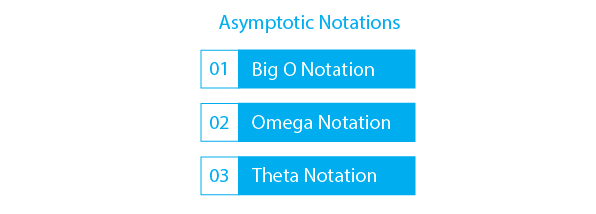

# Algorithm-Analysis-Github
 
# Algorithmic Adventures: A Journey Through the Labyrinth of Logic

This documentation serves as a living record of my exploration into the world of 
algorithms and their analysis. Every week, I update it with new insights, examples, 
and reflections on what I’ve learned. This is just the beginning—where it takes me, 
I don’t yet know, but I’m excited to continue asking, ‘What did I learn today?


## Authors

- [@Khaled_Alrefai](https://github.com/Kaldx5)


## Documentation

[Documentation](Documentation)


## Features in the Future

- Quantum Exploration: Study quantum algorithms and implement them on IBM's quantum computers using 10 minutes of runtime that I have for educational purposes.

- Efficiency Challenge: Analyze an existing algorithm and aim to reduce its running time by 15%.


I will take one of them only.

## Feedback

 I will ask my professor guides from time to time.

 If you have any feedback, please let me know.


# Hi, I'm Khaled! 👋


## Roadmap

- Algorithmic Complexity
- Sorting Algorithms
- Search Algorithms
- Tree Data Structures
- Complex Data Structures
- Indexing
- Problem Solving Techniques
- ...

## Lessons Learned
- lecture_01: I missed it.
- lecture_02: 
    - The behavior of an algorithm with incressing of input size- **Complexity.**
    - Asymptotic Notation- Worst, Best, and Average case.


## Screenshots




## Intro 

 **This person wants to go to that building, but he does not know the correct way, so he asks someone and gets the answer as follows:**
 - Go right.
 - Take the train.
 - Get off at the third stop.
This is called **Algorithm**, and to decide if the algorithm is good or not, do these steps:
 1. Correct- Result/Output.
 2. **Efficient**- Less time, space, and resources.
 3. Easy to implement.

* We study the Efficient for both Time and space complexity, when we study it, this is called **Analysis**.

When we create a new algorithm, we classify it into one of the categories of the **Algorithm Paradigms:** They are ways of thinking, such as
  - Greedy Algo. 
  - Divide and Conqure.  
  - Dynamic Programming. 
  - Incremental. 
  - Randomized/Probabilistic.

## Examples

```javascript
import Component from 'my-project'

function App() {
  return <Component />
}
```


## 🚀 About Me
I'm ...

## Links
- (https://www.prepbytes.com/blog/data-structure/big-o-notation-in-data-structure/)
## License

[MIT](https://choosealicense.com/licenses/mit/)


